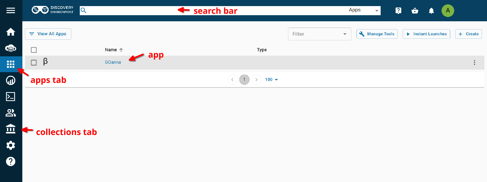
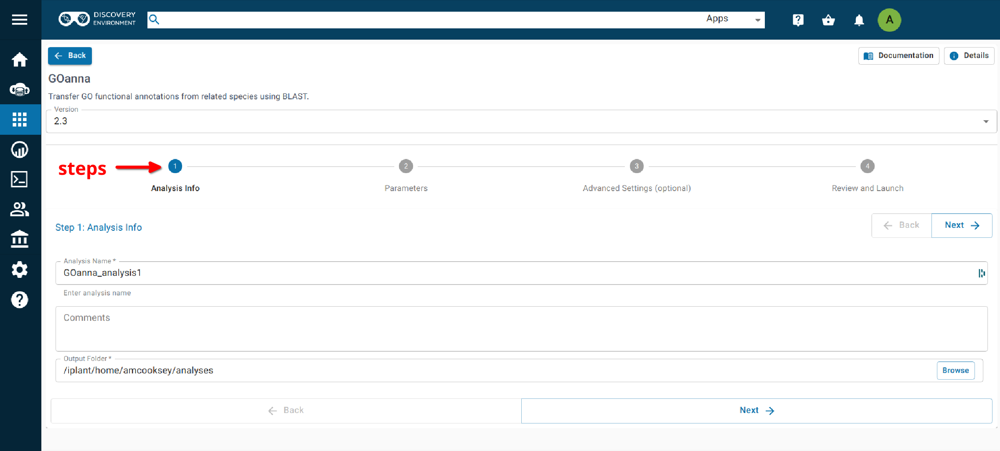

==========
**Intro**
==========

- GOanna performs a BLAST search, allows you to filter based on BLAST match parameters and transfers Gene Ontology (GO) functional annotations from the BLAST matches to your input genes.	
- GOanna accepts a protein FASTA file as input.
- BLAST databases are created by AgBase based upon proteins that have GO available and subsetted by phyla. We recommend selecting the database most closely related to the sequence used as input.
- We strongly recommend selecting only GO annotations based on experimental evidence codes. This will ensure the best quality annotations for your data.
- The remaining parameters are standard BLAST parameters. More information on determining the best BLAST parameters for your specific data set can be found in the section below.

Results and analysis from the application of GOanna to the Official gene set v3.0 protein set from *Diaphorina citri* followed by a differential expression analysis was presented at a seminar in the University of Arizona Animal and Comparative Biomedical Sciences in Fall 2020. The `slides <https://www.slideshare.net/suryasaha/functional-annotation-of-invertebrate-genomes>`_ and `video <https://arizona.zoom.us/rec/play/tZZ-fuutrj43T9fBtASDAaR9W9S0fP6s1XQbrvQOz0e0VnYHYVL1MOMaZ-F4v45qOmXQkV1MUXQ7tufD>`_ are available online.

**Where to Find GOanna** 
========================
- `Docker Hub <https://hub.docker.com/r/agbase/goanna>`_

- `CyVerse Discovery Environment <https://de.cyverse.org/de/?type=apps&app-id=354731ae-71ab-11e9-b82a-008cfa5ae621&system-id=de>`_

- `AgBase <https://agbase.arizona.edu/cgi-bin/tools/GOanna.cgi>`_

**Getting the GOanna Databases**
================================

To run the tool you need some public data. These files are now available as gzipped files to aid downloading. The directories are best downloaded with `iCommands <https://cyverse-data-store-guide.readthedocs-hosted.com/en/latest/step2.html>`_. Once iCommands is `setup <https://cyverse-data-store-guide.readthedocs-hosted.com/en/latest/step2.html#icommands-first-time-configuration>`_ you can use ‘iget’ to download the data.

1) agbase_database: species subset to run BLAST against  (this command will download the entire directory)

.. code-block:: bash

    iget -rPT /iplant/home/shared/iplantcollaborative/protein_blast_dbs/agbase_database

2) go_info: Uniprot GO annotations (this command will download the entire directory)

.. code-block:: bash

    iget -rPT /iplant/home/shared/iplantcollaborative/protein_blast_dbs/go_info

.. NOTE::

    Each of these tools accepts a peptide FASTA file. For those users with nucloetide sequences some documentation has been provided for using **TransDecoder** (although other tools are also acceptable). 
    The `TransDecoder app <https://de.cyverse.org/de/?type=apps&app-id=74828a18-f351-11e8-be2b-008cfa5ae621&system-id=de>`_ is available through CyVerse or as a `BioContainer <https://quay.io/repository/biocontainers/transdecoder?tab=tags>`_ for use on the command line.

.. _goannausage:

**Help and Usage Statement**
============================

.. code-block:: none

    Options:
    -a BLAST database basename ('arthropod', 'bacteria', 'bird', 'crustacean', 'fish', 'fungi', 'human', 'insecta',
       'invertebrates', 'mammals', 'nematode', 'plants', 'rodents' 'uniprot_sprot', 'uniprot_trembl', 'vertebrates'
        or 'viruses')
    -c peptide fasta filename
    -o output file basename
    [-b transfer GO with experimental evidence only ('yes' or 'no'). Default = 'yes'.]
    [-d database of query ID. If your entry contains spaces either substitute and underscore (_) or,
        to preserve the space, use quotes around your entry. Default: 'user_input_db']
    [-e Expect value (E) for saving hits. Default is 10.]
    [-f Number of aligned sequences to keep. Default: 3]
    [-g BLAST percent identity above which match should be kept. Default: keep all matches.]
    [-h help]
    [-m BLAST percent positive identity above which match should be kept. Default: keep all matches.]
    [-s bitscore above which match should be kept. Default: keep all matches.]
    [-k Maximum number of gap openings allowed for match to be kept.Default: 100]
    [-l Maximum number of total gaps allowed for match to be kept. Default: 1000]
    [-q Minimum query coverage per subject for match to be kept. Default: keep all matches]
    [-t Number of threads.  Default: 8]
    [-u 'Assigned by' field of your GAF output file. If your entry contains spaces (eg. firstname lastname)
        either substitute and underscore (_) or, to preserve the space, use quotes around your entry (eg. "firstname lastname")
        Default: 'user']
    [-x Taxon ID of the query species. Default: 'taxon:0000']
    [-p parse_deflines. Parse query and subject bar delimited sequence identifiers]
======================================
**GOanna on the Command Line**
======================================

**Getting the databases**
==========================
To run the tool you need some public data. These files are now available as gzipped files to aid downloading. The directories are best downloaded with `iCommands <https://cyverse-data-store-guide.readthedocs-hosted.com/en/latest/step2.html>`_. Once iCommands is `setup <https://cyverse-data-store-guide.readthedocs-hosted.com/en/latest/step2.html#icommands-first-time-configuration>`_ you can use ‘iget’ to download the data.

1) agbase_database: species subset to run BLAST against  (this command will download the entire directory)

.. code-block:: bash

    iget /iplant/home/shared/iplantcollaborative/protein_blast_dbs/agbase_database

2) go_info: Uniprot GO annotations (this command will download the entire directory)

.. code-block:: bash

    iget /iplant/home/shared/iplantcollaborative/protein_blast_dbs/go_info

**Container Technologies**
==========================
GOanna is provided as a Docker container. 

A container is a standard unit of software that packages up code and all its dependencies so the application runs quickly and reliably from one computing environment to another.

There are two major containerization technologies: **Docker** and **Singularity**. 

Docker containers can be run with either technology.

**Running GOanna using Docker**
===============================
.. admonition:: About Docker

    - Docker must be installed on the computer you wish to use for your analysis.
    - To run Docker you must have ‘root’ permissions (or use sudo).
    - Docker will run all containers as ‘root’. This makes Docker incompatible with HPC systems (see Singularity below).
    - Docker can be run on your local computer, a server, a cloud virtual machine (such as CyVerse Atmosphere) etc. Docker can be installed quickly on an Atmosphere instance by typing ‘ezd’.
    - For more information on installing Docker on other systems see this tutorial:  `Installing Docker on your machine <https://learning.cyverse.org/projects/container_camp_workshop_2019/en/latest/docker/dockerintro.html>`_.

**Getting the GOanna container**
--------------------------------
The GOanna tool is available as a Docker container on Docker Hub: 
`GOanna container <https://hub.docker.com/r/agbase/goanna>`_ 

The container can be pulled with this command: 

.. code-block:: bash

    docker pull agbase/goanna:2.3

.. admonition:: Remember

    You must have root permissions or use sudo, like so:

    sudo docker pull agbase/goanna:2.3

**Running GOanna with Data**
----------------------------

**Getting the Help and Usage Statement**
^^^^^^^^^^^^^^^^^^^^^^^^^^^^^^^^^^^^^^^^

.. code-block:: bash

    sudo docker run --rm -v $(pwd):/work-dir agbase/goanna:2.3 -h

See :ref:`goannausage`

.. tip::

    There are 3 directories built into this container. These directories should be used to mount data.
    
    - /agbase_database
    - /go_info
    - /work-dir

GOanna has three required parameters:

.. code-block:: bash

    -a BLAST database basename (acceptable options are listed in the help/usage)
    -c peptide FASTA file to BLAST
    -o output file basename

**Example Command**
^^^^^^^^^^^^^^^^^^^

.. code-block:: none

    sudo docker run \
    --rm \
    -v /location/of/agbase_database:/agbase_database \
    -v /location/of/go_info:/go_info \
    -v $(pwd):/work-dir \
    agbase/goanna:2.3 \
    -a invertebrates \
    -c AROS_10.faa \
    -o AROS_10_invert_exponly \
    -p \
    -g 70 \
    -s 900 \
    -d RefSeq \
    -u "Amanda Cooksey" \
    -x 37344 \
    -k 9 \
    -q 70

**Command Explained**
""""""""""""""""""""""""

**sudo docker run:** tells docker to run

**--rm:** removes the container when the analysis has finished. The image will remain for future use.

**-v /location/of/agbase_database:/agbase_database:** tells docker to mount the 'agbase_database' directory you downloaded to the host machine to the '/agbase_database' directory within the container. The syntax for this is: <absolute path on host>:<absolute path in container>

**-v /locaiton/of/go_info:/go_info:** mounts 'go_info' directory on host machine into 'go_info' directory inside the container

**-v $(pwd):/work-dir:** mounts my current working directory on the host machine to '/work-dir' in the container

**agbase/goanna:2.3:** the name of the Docker image to use

.. tip::

    All the options supplied after the image name are GOanna options

**-a invertebrates:** GOanna BLAST database to use--first of three required options.

**-c AROS_10.faa:** input file (peptide FASTA)--second of three required options

**-o AROS_10_invert_exponly:** output file basename--last of three required options

**-p:** our input file has NCBI deflines. This specifies how to parse them.

**-g 70:** tells GOanna to keep only those matches with at least 70% identity

**-s 900:** tells GOanna to keep only those matches with a bitscore above 900

**-d RefSeq:** database of query ID. This will appear in column 1 of the GAF output file.

**-u "Amanda Cooksey":** name to appear in column 15 of the GAF output file

**-x 37344:** NCBI taxon ID of input file species will appear in column 13 of the GAF output file

**-k 9:** tells GOanna to keep only those matches with a maximum number of 9 gap openings

**-q 70:** tells GOanna to keep only those matches with query coverage of 70 per subject

**Understanding Your Results**
^^^^^^^^^^^^^^^^^^^^^^^^^^^^^^
If all goes well, you should get 4 output files:

**<basename>.asn:** This is standard BLAST output format that allows for conversion to other formats. You probably won’t need to look at this output.

**<basename>.html:** This output displays in your web browser so that you can view pairwise alignments to determine BLAST parameters. 

**<basename>.tsv:** This is the tab-delimited BLAST output that can be opened and sorted in Excel to determine BLAST parameter values. The file contains the following columns:

- Query ID
- query length
- query start
- query end
- subject ID
- subject length
- subject start
- subject end
- e-value
- percent ID
- query coverage
- percent positive ID
- gap openings
- total gaps
- bitscore
- raw score

For more information on the BLAST output parameters see the `NCBI BLAST documentation <https://www.ncbi.nlm.nih.gov/books/NBK279684/#_appendices_Options_for_the_commandline_a_.>`_.

**<basename>_goanna_gaf.tsv:** This is the standard tab-separated `GO annotation file format <http://geneontology.org/docs/go-annotation-file-gaf-format-2.1>`_  that is used by the GO Consortium and by software tools that accept GO annotation files to do GO enrichment. 

If you see more files in your output folder there may have been an error in the analysis or there may have been no GO to transfer. `Contact us <agbase@email.arizona.edu>`_.

**Running GOanna using Singularity**
====================================

.. admonition:: About Singularity

    - does not require ‘root’ permissions
    - runs all containers as the user that is logged into the host machine
    - HPC systems are likely to have Singularity installed and are unlikely to object if asked to install it (no guarantees).
    - can be run on any machine where is is installed
    - more information about `installing Singularity <https://singularity.lbl.gov/docs-installation>`_
    - This tool was tested using Singularity 3.0. Users with Singularity 2.x will need to modify the commands accordingly.

.. admonition:: HPC Job Schedulers

    Although Singularity can be installed on any computer this documentation assumes it will be run on an HPC system. The tool was tested on a PBSPro system and the job submission scripts below reflect that. Submission scripts will need to be modified for use with other job scheduler systems.

**Getting the GOanna Container**
--------------------------------
The GOanna tool is available as a Docker container on Docker Hub: 
`GOanna container <https://hub.docker.com/r/agbase/goanna>`_ 

The container can be pulled with this command: 

.. code-block:: bash

    singularity pull docker://agbase/goanna:2.3

    
**Running GOanna with Data**
----------------------------

**Getting the Help and Usage Statement**
^^^^^^^^^^^^^^^^^^^^^^^^^^^^^^^^^^^^^^^^
**Example PBS script:**

.. code-block:: bash

    #!/bin/bash
    #SBATCH --job-name=goanna
    #SBATCH --ntasks=8
    #SBATCH --time=4:00:00
    #SBATCH --partition=short
    #SBATCH --account=nal_genomics
    
    module load singularity
    
    cd /where/to/save/singularity/image
    
    singularity pull docker://agbase/goanna:2.3
    
    singularity run \
    goanna_2.0.sif \
    -h

See :ref:`goannausage`

.. tip::

    There are 3 directories built into this container. These directories should be used to mount data.
    
    - /agbase_database
    - /go_info
    - /work-dir
    
GOanna has three required parameters:

.. code-block:: bash

    -a BLAST database basename (acceptable options are listed in the help/usage)
    -c peptide FASTA file to BLAST
    -o output file basename

**Example PBS Script**
^^^^^^^^^^^^^^^^^^^^^^

.. code-block:: bash

    #!/bin/bash
    #SBATCH --job-name=goanna
    #SBATCH --ntasks=8
    #SBATCH --time=4:00:00
    #SBATCH --partition=short
    #SBATCH --account=nal_genomics
    
    module load singularity
    
    cd /where/to/save/singularity/image
    
    singularity pull docker://agbase/goanna:2.3
    
    singularity run \
    -B /location/of/agbase_database:/agbase_database \
    -B /location/of/go_info:/go_info \
    -B /directory/where/you/will/work:/work-dir \
    goanna_2.3.sif \
    -a invertebrates \
    -c AROS_10.faa \
    -o AROS_10_invert_exponly \
    -p \
    -g 70 \
    -s 900 \
    -d RefSeq \
    -u "Amanda Cooksey" \
    -x 37344 \
    -t 28 \
    -q 70 \
    -k 9

**Command Explained**
""""""""""""""""""""""""

**singularity run:** tells Singularity to run

**-B /location/of/agbase_database:/agbase_database:** tells docker to mount the 'agbase_database' directory I downloaded to the host machine to the '/agbase_database' directory within the container. The syntax for this is: <absolute path on host>:<absolute path in container>

**-B /location/of/go_info:/go_info:** mounts 'go_info' directory on host machine into 'go_info' directory inside the container

**-B /directory/where/you/will/work:/work-dir:** mounts my current working directory on the host machine to '/work-dir' in the container

**goanna_2.3.sif:** the name of the Singularity image file to use

.. tip::

    All the options supplied after the image name are GOanna options

**-a invertebrates:** GOanna BLAST database to use--first of three required options.

**-c AROS_10.faa:** input file (peptide FASTA)--second of three required options

**-o AROS_10_invert_exponly:** output file basename--last of three required options

**-p:** our input file has NCBI deflines. This specifies how to parse them.

**-g 70:** tells GOanna to keep only those matches with at least 70% identity

**-s 900:** tells GOanna to keep only those matches with a bitscore above 900

**-d RefSeq:** database of query ID. This will appear in column 1 of the GAF output file.

**-u "Amanda Cooksey":** name to appear in column 15 of the GAF output file

**-x 37344:** NCBI taxon ID of input file species will appear in column 13 of the GAF output file

**-t 28:** number of threads to use for BLAST. This was run on a node with 28 cores.

**-k 9:** tells GOanna to keep only those matches with a maximum number of 9 gap openings

**-q 70:** tells GOanna to keep only those matches with query coverage of 70 per subject

**Understanding Your Results**
^^^^^^^^^^^^^^^^^^^^^^^^^^^^^^^
If all goes well, you should get 4 output files:

**<basename>.asn:** This is standard BLAST output format that allows for conversion to other formats. You probably won’t need to look at this output.

**<basename>.html:** This output displays in your web browser so that you can view pairwise alignments to determine BLAST parameters. 

**<basename>.tsv:** This is the tab-delimited BLAST output that can be opened and sorted in Excel to determine BLAST parameter values. The file contains the following columns:

- Query ID
- query length
- query start
- query end
- subject ID
- subject length
- subject start
- subject end
- e-value
- percent ID
- query coverage
- percent positive ID
- gap openings
- total gaps
- bitscore
- raw score

For more information on the BLAST output parameters see the `NCBI BLAST documentation <https://www.ncbi.nlm.nih.gov/books/NBK279684/#_appendices_Options_for_the_commandline_a_.>`_.

**<basename>_goanna_gaf.tsv:** This is the standard tab-separated `GO annotation file format <http://geneontology.org/docs/go-annotation-file-gaf-format-2.1>`_  that is used by the GO Consortium and by software tools that accept GO annotation files to do GO enrichment. 

If you see more files in your output folder there may have been an error in the analysis or there may have been no GO to transfer. `Contact us <agbase@email.arizona.edu>`_.

======================================
**GOanna on the ARS Ceres HPC**
======================================

**About Ceres/Scinet**
===============================
- The Scinet VRSC has installed GOanna for ARS use.
- For general information on Scinet/Ceres, how to access it, and how to use it, visit `https://usda-ars-gbru.github.io/scinet-site/ <https://usda-ars-gbru.github.io/scinet-site/>`_.

**Accessing the databases**
===========================
GOanna requires access to some public databases that are already available on Ceres. These need to be in your working directory when you run the program. The best way to set this up is to create symbolic links to the databases from your working directory.

1) agbase_database: species subset to run BLAST against

.. code-block:: bash

    ln -s /reference/data/iplant/2019-09-16/agbase_database

2) go_info: Uniprot GO annotations

.. code-block:: bash

    ln -s /reference/data/iplant/2019-09-16/go_info

**Running GOanna on Ceres**
===========================
.. admonition:: Running programs on Ceres/Scinet

    - You'll need to run GOanna either in interactive mode or batch mode.
    - For interactive mode, use the `salloc` command.
    - For batch mode, you'll need to write a batch job submission bash script.

**Running GOanna in interactive mode**
--------------------------------------

**Loading the module**
^^^^^^^^^^^^^^^^^^^^^^

The Scinet VRSC has installed the GOanna module. To load the module in interactive mode, run the command

.. code-block:: bash

    module load agbase

**Getting the Help and Usage Statement**
^^^^^^^^^^^^^^^^^^^^^^^^^^^^^^^^^^^^^^^^

.. code-block:: bash

    goanna -h

See :ref:`goannausage`

GOanna has three required parameters:

.. code-block:: bash

    -a BLAST database basename (acceptable options are listed in the help/usage)
    -c peptide FASTA file to BLAST
    -o output file basename

**Example Command**
^^^^^^^^^^^^^^^^^^^

.. code-block:: none

   goanna -c AROS_10.faa -a invertebrates -o goanna_output -p -g 70 -s 900 -d RefSeq -u Monica -x 37344

**Running GOanna in batch mode**
--------------------------------

.. admonition:: Running programs on Ceres/Scinet in batch mode

    - Before using batch mode, you should review Scinet/Ceres' documentation first, and decide what queue you'll want to use. See `https://usda-ars-gbru.github.io/scinet-site/guide/ceres/ <https://usda-ars-gbru.github.io/scinet-site/guide/ceres/>`_.

**Example batch job submission bash script (e.g. goanna-job.sh):**

.. code-block:: bash

    #! /bin/bash
    module load agbase
    goanna -c AROS_10.faa -a invertebrates -o goanna_output -p -g 70 -s 900 -d RefSeq -u Monica -x 37344

**Submitting the batch job:**

.. code-block:: bash

    sbatch goanna-job.sh

**GOanna Commands Explained**
-----------------------------

**-a invertebrates:** GOanna BLAST database to use--first of three required options.

**-c AROS_10.faa:** input file (peptide FASTA)--second of three required options

**-o goanna_output:** output file basename--last of three required options

**-p:** our input file has NCBI deflines. This specifies how to parse them.

**-g 70:** tells GOanna to keep only those matches with at least 70% identity

**-s 900:** tells GOanna to keep only those matches with a bitscore above 900

**-d RefSeq:** database of query ID. This will appear in column 1 of the GAF output file.

**-u "Monica":** name to appear in column 15 of the GAF output file

**-x 37344:** NCBI taxon ID of input file species will appear in column 13 of the GAF output file

**Understanding Your Results**
------------------------------

If all goes well, you should get 4 output files:

**<basename>.asn:** This is standard BLAST output format that allows for conversion to other formats. You probably won’t need to look at this output.

**<basename>.html:** This output displays in your web browser so that you can view pairwise alignments to determine BLAST parameters.

**<basename>.tsv:** This is the tab-delimited BLAST output that can be opened and sorted in Excel to determine BLAST parameter values. The file contains the following columns:

- Query ID
- query length
- query start<
- query end
- subject ID
- subject length
- subject start
- subject end
- e-value
- percent ID
- query coverage
- percent positive ID
- gap openings
- total gaps
- bitscore
- raw score

For more information on the BLAST output parameters see the `NCBI BLAST documentation <https://www.ncbi.nlm.nih.gov/books/NBK279684/#_appendices_Options_for_the_commandline_a_.>`_.

**<basename>_goanna_gaf.tsv:** This is the standard tab-separated `GO annotation file format <http://geneontology.org/docs/go-annotation-file-gaf-format-2.1>`_  that is used by the GO Consortium and by software tools that accept GO annotation files to do GO enrichment.

If you see more files in your output folder there may have been an error in the analysis or there may have been no GO to transfer. `Contact us <agbase@email.arizona.edu>`_.
===========================
**GOanna on CyVerse**
===========================

**Accessing GOanna in the Discovery Environment**
=================================================

1. `Create an account on CyVerse <user.cyverse.org>`_ (free). The user guide can be found `here <https://learning.cyverse.org/>`_.
2. Open the CyVerse Discovery Environment (DE) and login with your CyVerse credentials.
3. Click on the ‘Data’ tab at the left side of the screen to access your files/folders. Upload your data to the DE.
4. There are several ways to access the GOanna app:

- Use the `direct link <https://de.cyverse.org/apps/de/f707a7a4-4c3c-11ee-bba8-008cfa5ae621>`_.
- Search for 'GOanna" in the search bar at the top of the ‘apps’ tab.
- Follow the AgBase collection (collections tab on left side of DE)

|find_goanna|

**Using the GOanna App**
========================
**Launching the App**
---------------------

|goanna|

**Step 1. Analysis Info**
^^^^^^^^^^^^^^^^^^^^^^^^^

**Version:** All of the versions of the GOanna are now available in one place. Plese select the you want from the drop down box. The latest version is best unless you need reproduce a previous analysis.

**Analysis Name:GOanna_analysis1:**
This menu is used to name the job you will run so that you can find it later.
The default name is "GOanna_analysis1". We recommend changing the 'analysis1' portion of this to reflect the data you are running.

**Comments:**
(Optional) You can add additional information in the comments section to distinguish your analyses further.

**Select output folder:**
This is where your results will be placed. The default (recommended) is your 'analyses' folder.

**Step 2. Parameters**
^^^^^^^^^^^^^^^^^^^^^^

The 'input' section is used to select the BLAST database and your input file.

**BLAST database basename:** BLAST databases are created by AgBase based upon proteins that have GO available and subsetted by phyla. We recommend selecting the database most closely related to the sequence used as input.

**Peptide FASTA file:** Use the Browse button on the right hand side to navigate to your Data folder and select your protein sequence file.

Use the 'parameters' section to select your BLAST parameters.

**Transfer GO with experimental evidence only:** We strongly recommend selecting the “yes” option from the dropdown menu so that only GO annotations based on experimental evidence codes will be transferred . This will ensure the best quality annotations for your data.

The remaining parameters are standard BLAST parameters, and their defaults can be seen beneath the fields.

.. admonition:: Determining BLAST Parameters to Use

    BLAST parameters are contingent on the BLAST database used and the composition of the input file, and so will change for each analysis.

    Make a subset of 100 randomly selected sequences from your larger dataset and use this as the input for GOanna to test for parameters that give good alignments.

    1. To test for good parameters use GOanna by selecting the same database you will use and setting relaxed parameters.

    2. Once you have run your subsetted file, use the html file to view alignments, select good alignments and note the parameters for these.

**Parse query and subject bar delimited sequence identifiers:** This option should be selected if you are using a fasta file with headers that include pipes (|). They will not format correctly otherwise.

    If the ‘parse-deflines’ option is not checked then BLAST will interpret the ID to be everything before the first space.

The 'output' section is used to format your GO annotation results into a standard gene association file format.

**Output File basename:** This will be the prefix for your output files. A good name choice is to use the fasta file name (without file extension).

**Database of query ID:** Use the database that sequences were obtained from (e.g. Refseq), or a recognizable project name if these sequences are not in a database (e.g., i5k project or Smith Lab). The default is 'user_input_db'.

**'Assigned by' field of your GAF output file:** Enter the name of the entity assigning the function (e.g. Agbase, or Smith Lab). This field is used to track who made the annotations. The default is 'user'.

**Taxon ID of the query species:** Enter the NCBI taxon number for your species. This can be found by searching for your species name (common or scientific) in the `NCBI taxon database <https://www.ncbi.nlm.nih.gov/taxonomy>`_. The default is "0000".

**Step3. Adavanced Settings (optional)**
^^^^^^^^^^^^^^^^^^^^^^^^^^^^^^^^^^^^^^^^

This page allows you specifiy compute requirements for your analysis (e.g. more memory if your analysis is particularly large). You should be able to leave the defaults for most analyses.

**Step4. Review and Launch**
^^^^^^^^^^^^^^^^^^^^^^^^^^^^

This will display all of the parameters you have set (other than default). Missing information that is required will displayed in red. Make sure you are happy with your choices and then clicke the 'launch' button at the bottom.

**Understanding Your Results**
==============================

If all goes well, you should get 4 output files and a ‘logs’ folder.

**<basename>.asn:** This is standard BLAST output format that allows for conversion to other formats. You probably won’t need to look at this output.

**<basename>.html:** This output displays in your web browser so that you can view pairwise alignments to determine BLAST parameters.

**<basename>.tsv:** This is the tab-delimited BLAST output that can be opened and sorted in Excel to determine BLAST parameter values. The file contains the following columns:

- query ID
- query length
- query start
- query end
- subject ID
- subject length
- subject start
- subject end
- e-value
- percent ID
- query coverage
- percent positive ID
- gap openings
- total gaps
- bitscore
- raw score

For more information on the BLAST output parameters see the `NCBI BLAST documentation <https://www.ncbi.nlm.nih.gov/books/NBK279684/#_appendices_Options_for_the_commandline_a_.>`_.

**<basename>_goanna_gaf.tsv:** This is the standard tab-separated `GO annotation file format <https://geneontology.github.io/docs/go-annotation-file-gaf-format-2.2/>`_  that is used by the GO Consortium and by software tools that accept GO annotation files to do GO enrichment. 

If you see more files in your output folder there may have been an error in the analysis or there may have been no GO to transfer. Check the 'condor_stderr' file in the analysis output 'logs' folder.

If that doesn't clarify the problem contact us at agbase@email.arizona.edu or support@cyverse.org.

